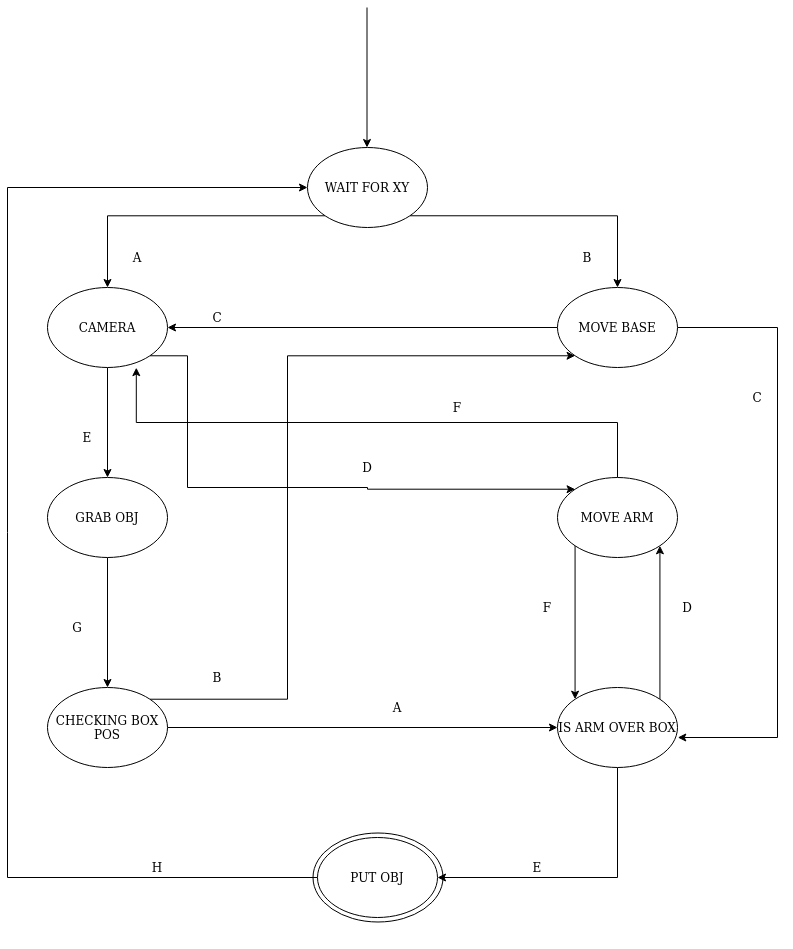
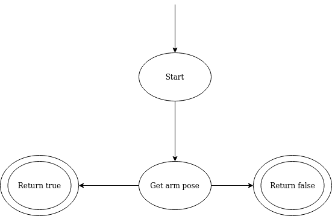
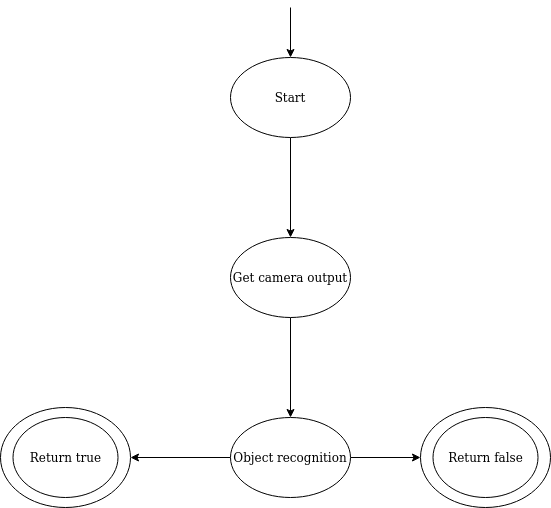
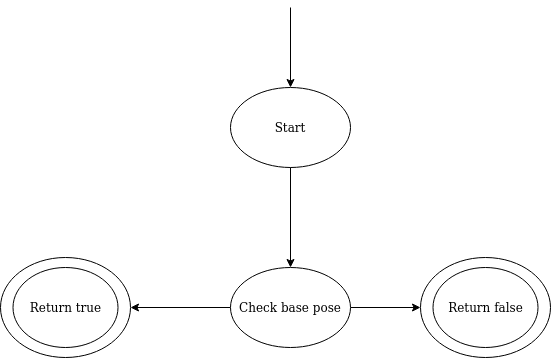
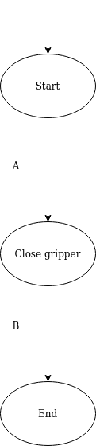
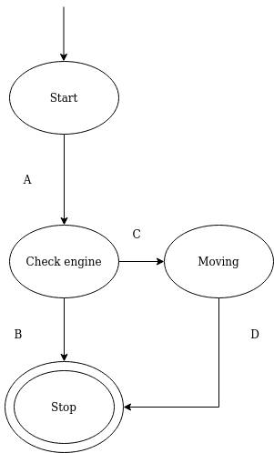
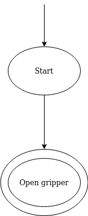

# teoria_sterowania_projekt

Celem robota jest poruszanie się po hali, zbieranie przedmiotów i później odkładanie ich w wyznaczonym miejscu. Rozplanowanie zadań przedstawiono na schemacie poniżej. 

Schemat automatu nadrzędnego          | Automat arm_box
:-------------------------:|:-------------------------:
  |  
s3          |  s4

  |  
s5         |  s6
:-------------------------:|:-------------------------:
  |  
s5         |  s6
:-------------------------:|:-------------------------:
  |  

Domyślnie robot czeka na przesłanie mu koordynatów xy obiektu do zabrania. Okresla to stan "wait for xy". W momencie odebrania koordytantów sprawdzane jest, czy obiekt znajduje się w zasięgu bazy robota. Jeżeli tak, to następuje wydarzenie A ("base is near"), jeżeli nie to wydarzenie B ("base is not near"). W przypadku wydarzenia B następuje przejście do stanu "move base", który oblicza a następnie porusza się do przestrzeni, w kótrej obiekt będzie w zasięgu bazy (wydarzenie C - "move was done").  Przejście z "wait for xy" poprzez wydarzenie A albo z "move base" przez wydarzenie C prowadzi do stanu "cam". Następuje wtedy sprawdzenie, czy obiekt jest w zasięgu ramienia (na podstawie kamery). Jeżeli nie jest następuje wydarzenie D (arm in not near) i przejście do stanu "move arm", skąd po wykonaniu ruchu ramienia tak, aby mozna było złapać obiekt, następuje wydarzenie F (arm move was done) i powrót do stanu, gdzie kamera sprawdza, czy jesteśmy wstanie chwycić obiekt. Gdy ramie znajduje się w odpowiedniej pozycji, nastepuje poprzez wydarzenie E ("arm is near") przejście do stanu Grab Obj. Z tego stanu, poprzez wydarzenie G "obj was grabbed" przejście do stanu "checking box pos". Następuje sprawdzenie, gdzie znajduje się docelowe miejsce na odłożenie przedmiotu. Jeżeli punkt docelowy znajduje się poza zasięgiem bazy, nastepuje ponownie wydarzenie B ("base is not near"), które prowadzi do stanu Move base, gdzie po wykonaniu ruchu następuje wydarzenie C "move was done" i przejście do wydarzenia "is arm over box". 
Jeżeli w wydarzeniu "Checking box pos" jednak baza będzie w odpowiedniej odległości od miejsca docelowego, wtedy następuje przejście do stanu "is arm over box" poprzez wydarzenie A (base is near). W stanie "is arm over box" wykonywane jest sprawdzenie, czy ramie jest w odpowiednim miejscu, aby odłożyć obiekt, jeżeli nie, poprzez wydarzenie D ("arm is not near") nastepuje przejście do stanu Move arm, skąd po wykonaniu ruchu następuje przejście spowrotem do stanu "is arm over box" poprzez wydarzenie F ("arm move was done"). W momencie, gdy ramie jest w odpowiedniej pozycji, aby odłożyć obiekt, nastepuje przejście ze stanu "is arm over box" do stanu "put obj" przez wydarzenie E ("arm is near"). Nastepnie obiekt zostaje odłożony i poprzez wydarzenie H ("obj was put") nastepuje powrót do domyślnej pętli ("wait for xy").

